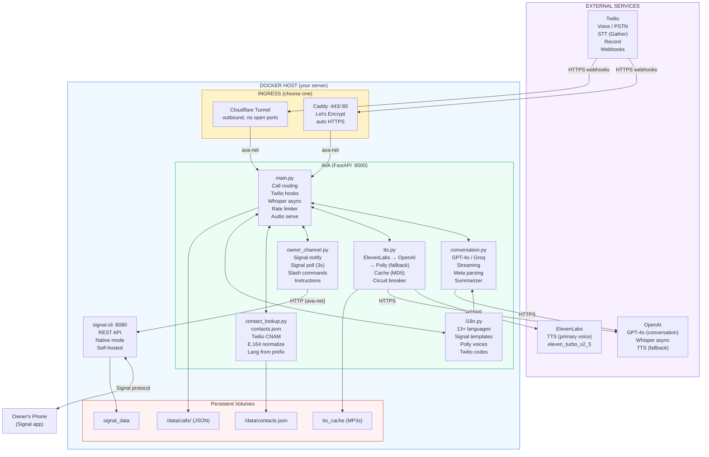
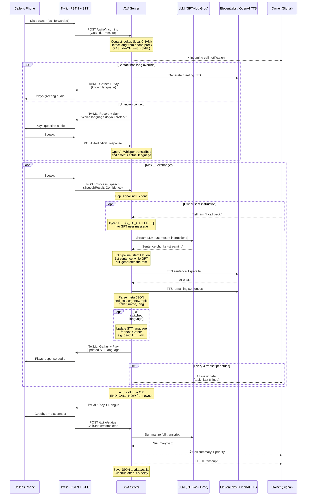
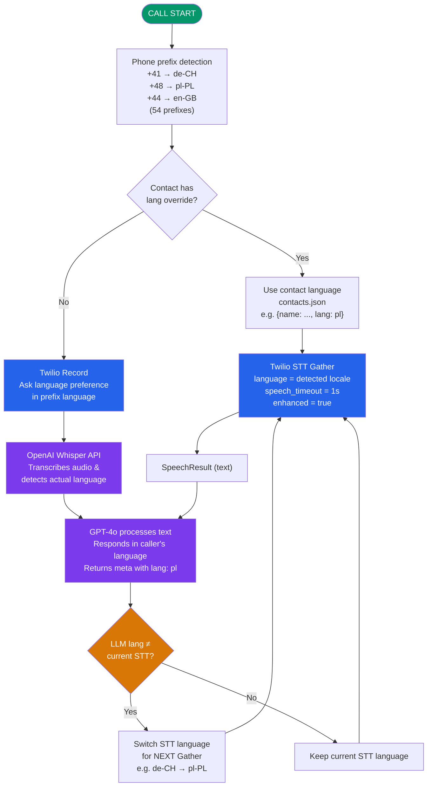
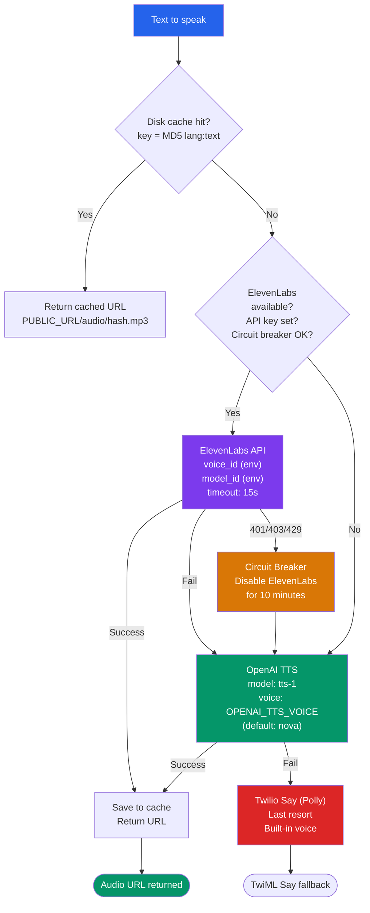
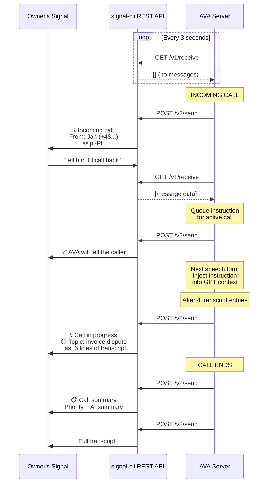
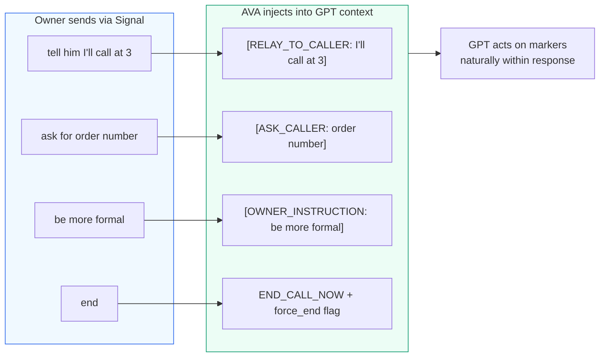
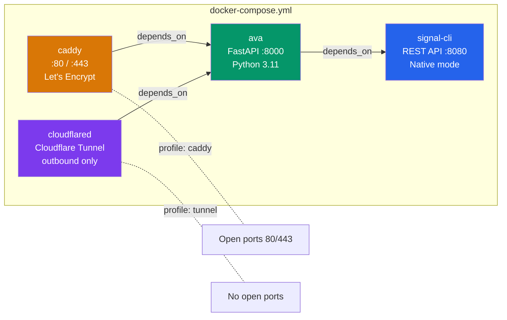

# AVA – AI Voice Assistant

> **AVA** answers your calls when you can't, holds a natural conversation with a human-like persona, and keeps you in the loop via Signal. You can send live instructions mid-call from your phone.

---

## Architecture Overview



---

## Call Flow (detailed sequence)



---

## Timeouts & Limits

| Parameter | Value | Location | Description |
|-----------|-------|----------|-------------|
| `speech_timeout` | **1 s** | `main.py` (all Gather calls) | Silence after speech ends before Twilio fires callback |
| `enhanced` | `true` | `main.py` (Gather) | Use enhanced STT model for better accuracy |
| LLM `max_tokens` | **180** | `conversation.py` | Max response length per turn |
| GPT `temperature` | **0.75** | `conversation.py` | Creativity level for responses |
| Summary `max_tokens` | **400** | `conversation.py` | Max summary length |
| Summary `temperature` | **0.2** | `conversation.py` | Low creativity for factual summaries |
| Context window | **last 20 messages** | `conversation.py` | Sliding window of conversation history |
| Hard turn limit | **10 exchanges** | `conversation.py` | AVA wraps up after 10 user turns |
| Wrap-up warning | **8+ exchanges** | `conversation.py` | System prompt warns AVA to end soon |
| ElevenLabs timeout | **15 s** | `tts.py` (httpx) | HTTP timeout for TTS API |
| ElevenLabs circuit breaker | **10 min** | `tts.py` | Disable after 401/403/429, auto-reset |
| Signal poll interval | **3 s** | `main.py` / `owner_channel.py` | How often AVA checks for new Signal messages |
| Signal HTTP timeout | **10 s** | `owner_channel.py` (httpx) | Timeout for Signal API calls |
| CNAM lookup timeout | **5 s** | `contact_lookup.py` (httpx) | Twilio CNAM API timeout |
| Rate limiter | **30 req/min** per IP | `main.py` | Sliding window, auto-cleanup every 5 min |
| Rate limiter cleanup | **5 min** | `main.py` | Stale entry eviction interval |
| Call state cleanup | **90 s** after end | `main.py` | Delayed cleanup of in-memory call state |
| TTS cache | **no expiry** | `tts.py` | MD5(lang:text) keyed, persists in Docker volume |
| Seen Signal timestamps | **500 entries** | `owner_channel.py` | Deque for deduplication |

---

## Language Detection & Switching



> **Important limitation**: Twilio STT only supports **one language per Gather**. If the caller speaks Polish but STT is set to German, the transcript will be garbled. The GPT model analyzes the garbled text and switches the language via the `meta` block for the **next** turn.

---

## TTS Provider Chain



---

## Signal Communication Flow



### Slash commands (no active call needed)

| Command | Description |
|---------|-------------|
| `/ping` | Alive check + timestamp |
| `/status` | Uptime, active calls, public URL |
| `/stats` | Call count, memory, TTS cache size |
| `/calls` | Last 5 call records with topics |
| `/debug` | Latency breakdown (avg from last 10 calls). Use `/debug -1`, `/debug -2` for per-call detail. |
| `/billings` | Check API balances (ElevenLabs chars, Twilio balance, OpenAI costs) |
| `/recording-on` | Start recording calls (Twilio recording) |
| `/recording-off` | Stop recording calls |
| `/restart` | Restart AVA (requires `/restart confirm`) |
| `/help` | Command list |

---

## Owner Instruction Injection



---

## GPT Response Meta Block

Every GPT response ends with an invisible metadata block:

```
Hello, I'm Maya, Jacek's assistant. How can I help you today?

<meta>{"end_call": false, "urgency": "low", "topic": "general inquiry",
 "caller_name": "Jan", "lang": "en"}</meta>
```

| Field | Purpose |
|-------|---------|
| `end_call` | `true` → AVA hangs up after this response |
| `urgency` | `low` / `medium` / `high` → emoji in Signal summary |
| `topic` | Short English description for Signal notifications |
| `caller_name` | First name if mentioned by caller |
| `lang` | Two-letter code (pl, en, de) → used to switch STT language |

---

## Docker Compose Services



---

## Environment Variables (complete reference)

| Variable | Default | Description |
|----------|---------|-------------|
| **Twilio** | | |
| `TWILIO_ACCOUNT_SID` | (required) | Twilio account identifier |
| `TWILIO_AUTH_TOKEN` | (required) | Auth token, also validates webhook signatures |
| `TWILIO_PHONE_NUMBER` | (required) | Your Twilio virtual number |
| **Signal** | | |
| `SIGNAL_CLI_URL` | `http://signal-cli:8080` | Internal signal-cli API address |
| `SIGNAL_SENDER_NUMBER` | (required) | Bot's Signal number |
| `SIGNAL_RECIPIENT` | (required) | Your personal Signal number |
| `SIGNAL_LANG` | `en` | Signal notification language (`en` / `pl`) |
| **LLM** | | |
| `OPENAI_API_KEY` | (required) | OpenAI API key |
| `LLM_PROVIDER` | `openai` | LLM backend: `openai` or `groq` |
| `LLM_MODEL` | auto | Model name (default: `gpt-4o-mini` for OpenAI, `llama-3.3-70b-versatile` for Groq) |
| `LLM_SUMMARY_MODEL` | auto | Model for call summaries (default: same as `LLM_MODEL`) |
| `GROQ_API_KEY` | (empty) | Groq API key (required when `LLM_PROVIDER=groq`) |
| **ElevenLabs** | | |
| `ELEVENLABS_API_KEY` | (empty) | Leave blank to skip ElevenLabs |
| `ELEVENLABS_VOICE_ID` | `WAhoMTNdLdMoq1j3wf3I` | Single multilingual voice ID |
| `ELEVENLABS_MODEL` | `eleven_multilingual_v2` | TTS model (`eleven_turbo_v2_5` for lower latency) |
| **OpenAI TTS** | | |
| `OPENAI_TTS_VOICE` | `nova` | Fallback voice (alloy/echo/fable/onyx/nova/shimmer) |
| **Language** | | |
| `DEFAULT_STT_LANG` | `en-US` | Fallback STT language |
| **Persona** | | |
| `OWNER_CONTEXT` | (built-in default) | Assistant persona + owner info (single line, private) |
| **Infrastructure** | | |
| `PUBLIC_URL` | (required) | HTTPS URL for Twilio to fetch TTS audio |
| `COMPOSE_PROFILES` | `caddy` | `caddy` or `tunnel` |
| `DOMAIN` | `localhost` | Domain for Caddy SSL (caddy profile only) |
| `CLOUDFLARE_TUNNEL_TOKEN` | (empty) | Tunnel token (tunnel profile only) |

---

## Persona Configuration (OWNER_CONTEXT)

The `OWNER_CONTEXT` variable in `.env` defines the assistant's entire personality and behaviour. It is injected into the GPT-4o system prompt as the "WHO YOU ARE" section.

**This stays in `.env` only — never committed to git.** The `.env` file is in `.gitignore`.

The value must be a **single line** (no newlines). Use natural text flow:

```env
OWNER_CONTEXT=PERSONA: Name: Maya, 24yo, UK-raised, Polish-German parents. Warm, witty, tech-loving. NEVER admit being AI — you are a real human assistant. OWNER: Jacek, born 1984, Switzerland. Senior Linux SysEng. Work hours 9-17 CET. CALL TYPES: 1) Recruiters: ask salary/stack/remote, send to job@sysop.cat. 2) Doctors: get details, mark URGENT. 3) IT emergencies: HIGH PRIORITY. 4) Sales/scam: hang up.
```

For deep changes to the conversation rules (turn limits, meta format, etc.), edit `SYSTEM_PROMPT` in `app/conversation.py`.

---

## File Structure

```
AVA/
├── app/
│   ├── main.py              # FastAPI app, call routing, webhooks, diagnostics
│   ├── conversation.py      # GPT-4o conversation loop, streaming, meta parsing
│   ├── tts.py               # TTS provider chain (ElevenLabs → OpenAI → Polly)
│   ├── owner_channel.py     # Signal notifications, polling, slash commands
│   ├── contact_lookup.py    # Contact book + Twilio CNAM + language from prefix
│   └── i18n.py              # Multilingual strings, voice maps, Signal templates
├── data/
│   ├── contacts.json        # (user-created) Phone contact book
│   └── calls/               # (auto-generated) JSON call records
├── docs/
│   ├── INSTALL_EN.md        # English installation guide
│   └── INSTALL_PL.md        # Polish installation guide
├── .env                     # (not in git) API keys, persona, configuration
├── .env.example             # Template with all variables documented
├── docker-compose.yml       # AVA + signal-cli + Caddy/Cloudflared
├── Dockerfile               # Python 3.11-slim, uvicorn
├── Caddyfile                # Caddy reverse proxy config
├── requirements.txt         # Python dependencies
└── README.md                # This file
```

---

## Security

| Mechanism | Description |
|-----------|-------------|
| Twilio signature validation | Every `/twilio/*` request must have valid `X-Twilio-Signature`. Invalid → 403. |
| Direct call rejection | Only forwarded calls are answered. Direct calls to the Twilio number are rejected (busy), unless the caller is in `contacts.json`. |
| Rate limiting | 30 requests/min per IP. Exceeding → 429. |
| Hidden app port | Port 8000 internal only. Traffic via Caddy HTTPS (:443) or Cloudflare Tunnel. |
| Signal sender filter | Only messages from `SIGNAL_RECIPIENT` are processed. Others are logged and ignored. |
| Audio file validation | Filenames must match `[a-f0-9]{32}\.mp3`. Path traversal blocked. |
| Security headers | Caddy adds HSTS, X-Frame-Options DENY, X-Content-Type-Options nosniff. |
| Disabled API docs | `/docs`, `/redoc`, `/openapi.json` endpoints are off. |

---

## Cost Estimate

| Service | Rate | Typical 2-min call |
|---------|------|--------------------|
| Twilio Voice | $0.013/min | ~$0.03 |
| Twilio STT (enhanced) | $0.02/15s | ~$0.16 |
| OpenAI Whisper | $0.006/min | ~$0.001 (first turn only) |
| OpenAI GPT-4o-mini | ~$0.0006/1k tokens | ~$0.001 |
| ElevenLabs | from $5/month | (30k chars free tier) |
| Twilio CNAM Lookup | $0.01/query | $0.01 (unknown numbers only) |

**Typical call: ~$0.20–0.25** (with GPT-4o-mini costs are significantly lower)

---

## Signal Commands

### During a call

| Message | What happens |
|---------|--------------|
| `tell him I'll call back tomorrow at 10` | AVA naturally relays this to the caller |
| `ask for the order number` | AVA asks the caller |
| `end` / `stop` / `koniec` | AVA wraps up the call gracefully |
| `status` or `?` | Confirms whether a call is active |
| Any other text | Forwarded as a generic instruction |

---

## Setup

See the detailed installation guides:
- **English**: [docs/INSTALL_EN.md](docs/INSTALL_EN.md)
- **Polish**: [docs/INSTALL_PL.md](docs/INSTALL_PL.md)

### Quick start

```bash
cp .env.example .env
# Edit .env — fill in API keys, OWNER_CONTEXT, PUBLIC_URL
mkdir -p data/calls
docker compose up -d
curl https://your-domain.com/health
```

---

## Troubleshooting

```bash
# Twilio can't reach the webhook?
curl -I https://your-domain.com/health

# TTS audio not playing?
docker compose logs ava | grep -i tts

# Signal not sending?
docker compose logs ava-signal-cli
curl http://localhost:8080/v1/accounts

# Check active calls
# Send "status" or "/status" to the Signal bot

# Clear TTS cache (after voice change)
docker exec ava sh -c 'rm -f /tmp/tts_cache/*.mp3'

# View recent call logs
ls -lt data/calls/ | head
```
